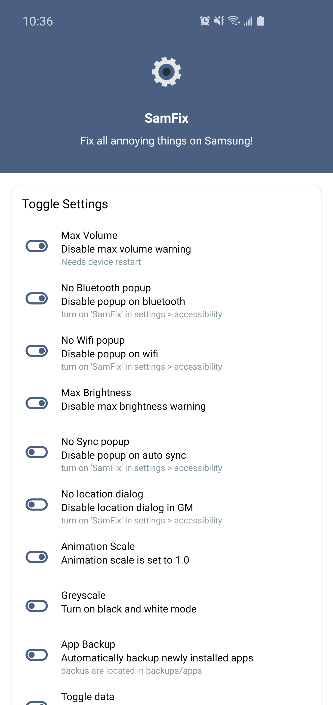
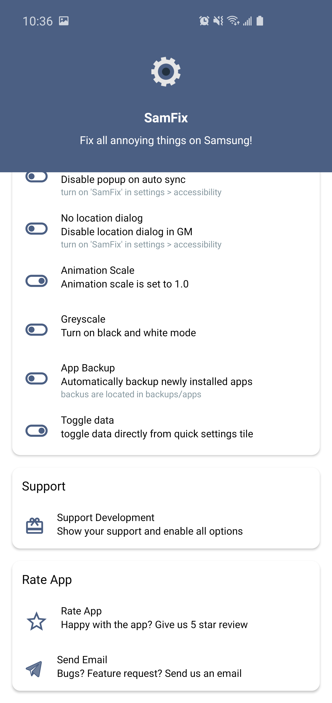
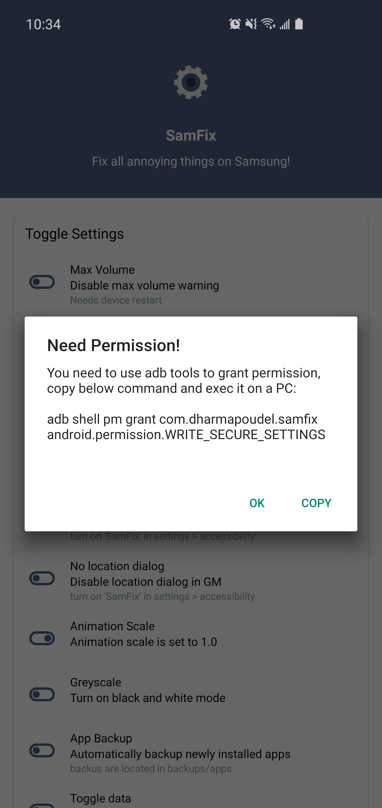

#  SamFix

Fix all annoyances on Samsung devices. 

## Download :

## Target platforms :

API 21 or later

## Features :

-	Disable max volume warning - needs device restart
-	Disable max brightness warning 
-	Choose animation scale from the list - make your device snappier
-	Greyscale - turn on black and white mode, it's fun and saves power on AMOLEDs
-	Disable Bluetooth popup - needs accessibility permission
-	Disable Wifi popup - needs accessibility permission
-	Disable popup on auto sync - needs accessibility permission
-	Quick setting tiles for easy animation/greyscale/data toggling
-   ... more to come in the near future

## Screenshots :

  
